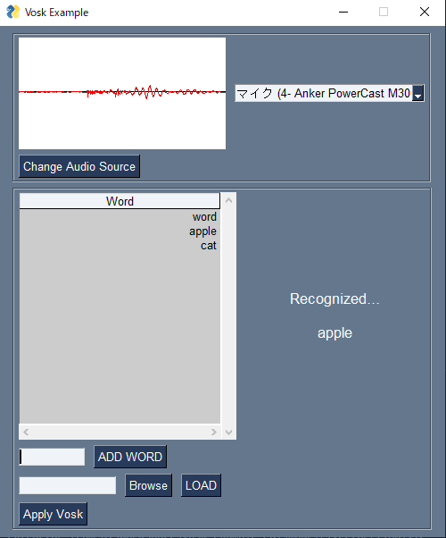

# vosk_example_gui

# Overview
[Vosk](https://github.com/alphacep/vosk-api)と[PySimpleGUI](https://github.com/PySimpleGUI/PySimpleGUI)を組み合わせた検証用GUIのリポジトリです。



2022/10/23現在、以下のような機能を実装しています。

- マイク選択機能
- 音声信号描画機能
- Vosk認識単語指定機能
- Vosk認識単語追加機能

# Environment
- Windows 10 home
- Python3.8

# Usage

## 環境構築

Poetryがインストールされている状態で以下を実行する。

```
$poetry install
```

もしくは、Poetry環境がない場合は以下を実行する。

```
$pip install -r requirements.txt
```

## 実行方法

[ここ](https://alphacephei.com/vosk/models)から **[vosk-model-small-en-us-0.15]** をダウンロードして```model```とリネームしてカレントディレクトリに格納する。

格納が完了したら以下コマンドを実行する。

```shell
# poetryの場合
$poetry run python -m vosk_example_gui

# それ以外の場合
$python -m vosk_example_gui
```

# Author

[T-Sumida](https://twitter.com/sumita_v09)

# License
vosk_example_gui is under MIT License.