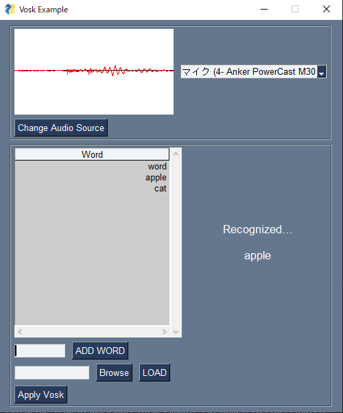

[[Japanese](./README.md)/English]

# vosk_example_gui

# Overview
This is a repository of GUI for verification that combines [Vosk](https://github.com/alphacep/vosk-api) and [PySimpleGUI](https://github.com/PySimpleGUI/PySimpleGUI).



As of 10/23/2022, the following features have been implemented.

- Microphone selection function
- Voice signal drawing function
- Vosk recognition word specification function
- Add Vosk recognition word function

# Environment
- Windows 10 home
- Python3.8

# Usage

## 環境構築

With Poetry installed, perform the following

```
$poetry install
```

Or, if you do not have a Poetry environment, do the following

```
$pip install -r requirements.txt
```

## 実行方法

Download **[vosk-model-small-en-us-0.15]** from [here](https://alphacephei.com/vosk/models), rename it ``model`` and store it in the current directory.

After the storage is completed, execute the following command.

```shell
# The case of Poetry
$poetry run python -m vosk_example_gui

# otherwise
$python -m vosk_example_gui
```

# Author

[T-Sumida](https://twitter.com/sumita_v09)

# License
vosk_example_gui is under MIT License.